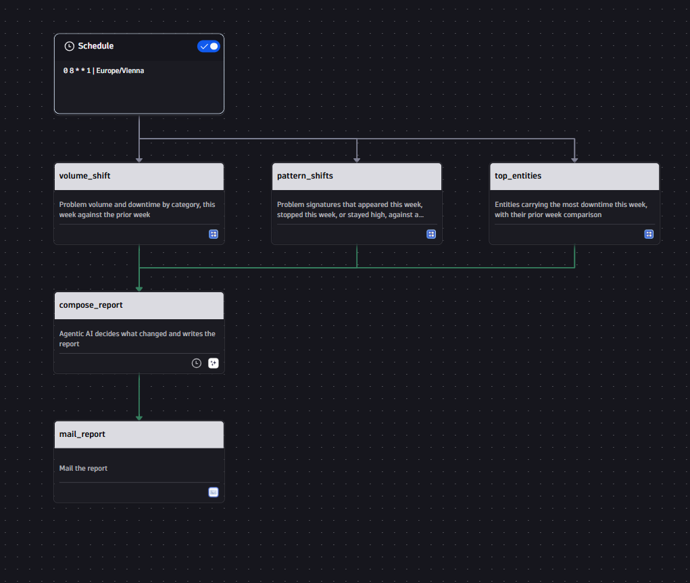
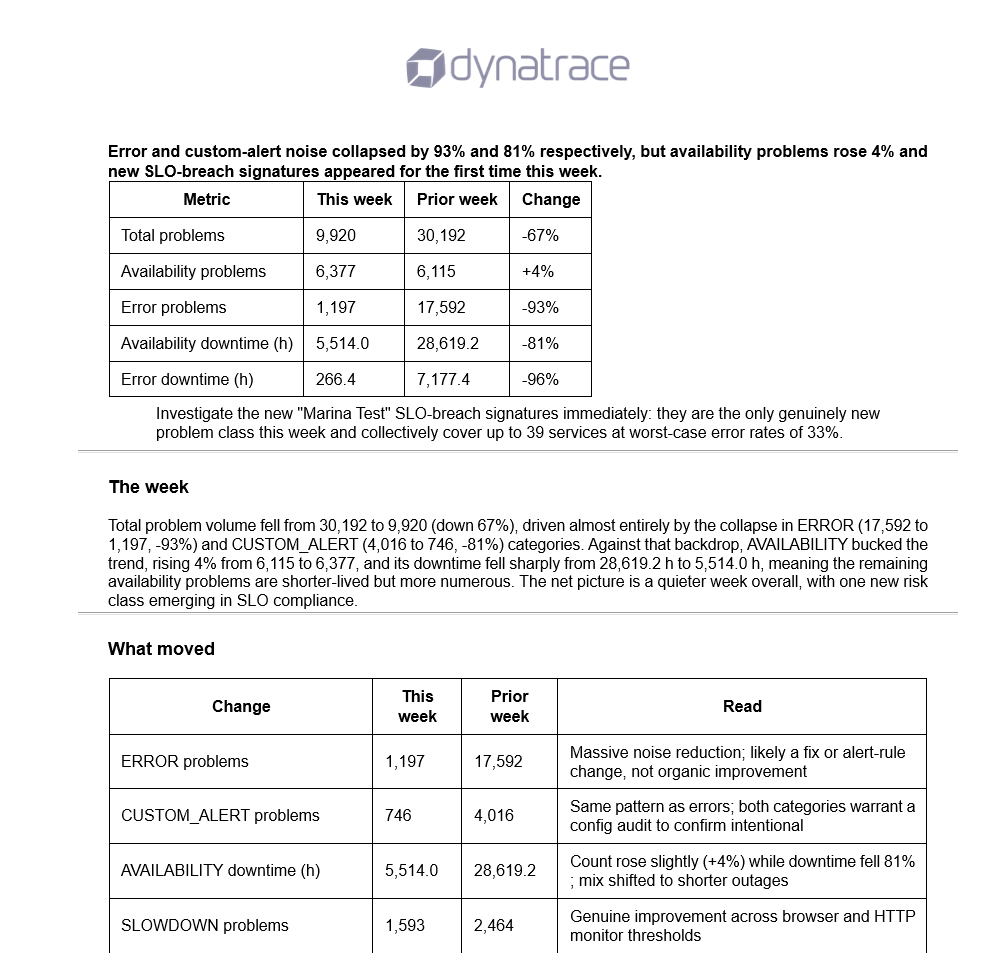

# Agentic Weekly Operations Report

Skip the fixed weekly template that reports the same five metrics no matter what happened. This workflow reads the week against the week before, decides for itself what actually changed, and reports only what's worth attention.

## What it does

Every Monday morning, this workflow runs three DQL queries against `dt.davis.problems` — problem volume and downtime by category, chronic vs. new-or-stopped problem signatures against a three-week baseline, and the entities carrying the most downtime — then hands all three result sets to an agentic AI prompt task.

The agent isn't asked to summarize metrics. It's instructed to work out what changed, decide what's worth surfacing, and write a structured report: an executive one-liner, a "what moved" table, a "new and stopped" table (treating brand-new problem signatures as the highest-value finding even when their counts are small), a "where the time went" table, and exactly three prioritized next actions. It's told explicitly to skip a section if it's genuinely empty rather than pad a quiet week into a busy-sounding report, and to never invent a number or entity that isn't in the data. The finished report is emailed automatically.

> Questions or issues with this example? Open a [GitHub issue](../../issues) or ask in **#help-community-examples** on Slack.

## Screenshots

## Prerequisites

- Dynatrace tenant with Davis problems being generated (any monitored environment)
- Apps: `dynatrace.automations` (Workflows), `dynatrace.davis.workflow.actions` (Agentic AI prompt action), `dynatrace.email`
- An email connection configured for the `dynatrace.email:send-email` action

## Setup

1. Download `agentic-weekly-operations-report.workflow-template.yaml`.
2. In your Dynatrace environment, open **Workflows** → **Create workflow** → **Upload YAML** (or the `...` menu → **Import**) and select the file.
3. Open the `mail_report` task and set the actual **to** recipients (the template ships with empty `to`/`cc`/`bcc`).
4. Review the schedule (`0 8 * * 1`, Mondays 08:00 Europe/Vienna) and adjust the cron/timezone if needed.
5. Enable the workflow.

## Configuration

- **Recipients:** set in the `mail_report` task's `to`/`cc`/`bcc` fields.
- **Schedule:** the `trigger.schedule` block — default is weekly, Monday 08:00, `Europe/Vienna`.
- **Lookback windows:** the three DQL tasks use 14-day (`volume_shift`, `top_entities`) and 28-day (`pattern_shifts`) windows to build the week-over-week and three-week-baseline comparisons — adjust the `from:` clauses if your team needs a different cadence.
- **Report tone and structure:** the `compose_report` task's `prompt` and `instruction` fields fully control the report's sections, tone, word limit (under 700 words), and formatting rules (e.g. no em dashes, durations in hours not nanoseconds). Edit these to match your team's reporting style.
- **Report title/link:** the `mail_report` task's `content` references the tenant URL and execution ID — update the URL to your own tenant.

## Notes & limitations

- The workflow template references a specific dev tenant URL (`umsaywsjuo.dev.apps.dynatracelabs.com`) in the `compose_report` prompt and the `mail_report` footer — replace with your own tenant before running.
- Depends on `dynatrace.davis.workflow.actions` (Agentic AI prompt action), which may require your tenant to have Davis CoPilot / Agentic AI features enabled.
- The agent is instructed to ground every claim in the query results and flag suspicious numbers rather than assert a cause — review the prompt's rules section before adapting it for a different data domain.

## Related solutions

- [chronic-problem-pattern-advisor/](../chronic-problem-pattern-advisor/) — same agentic-report pattern, applied to a 30-day chronic problem review instead of a weekly one
- [create-postmortem/](../create-postmortem/) — daily agentic postmortem drafting for the most costly resolved incident
