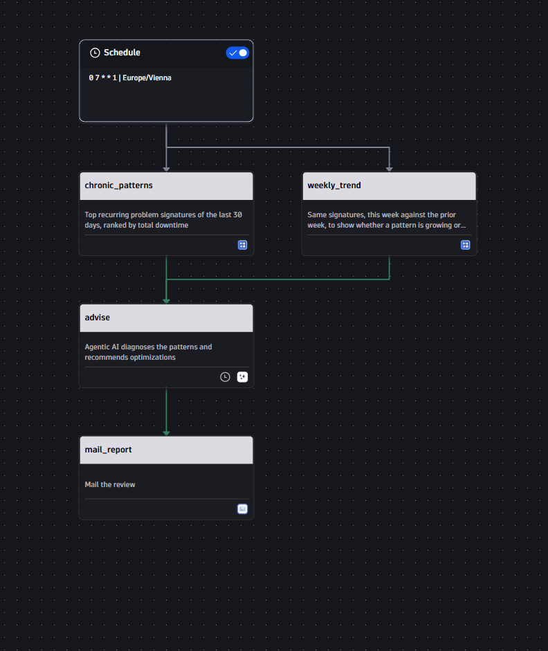
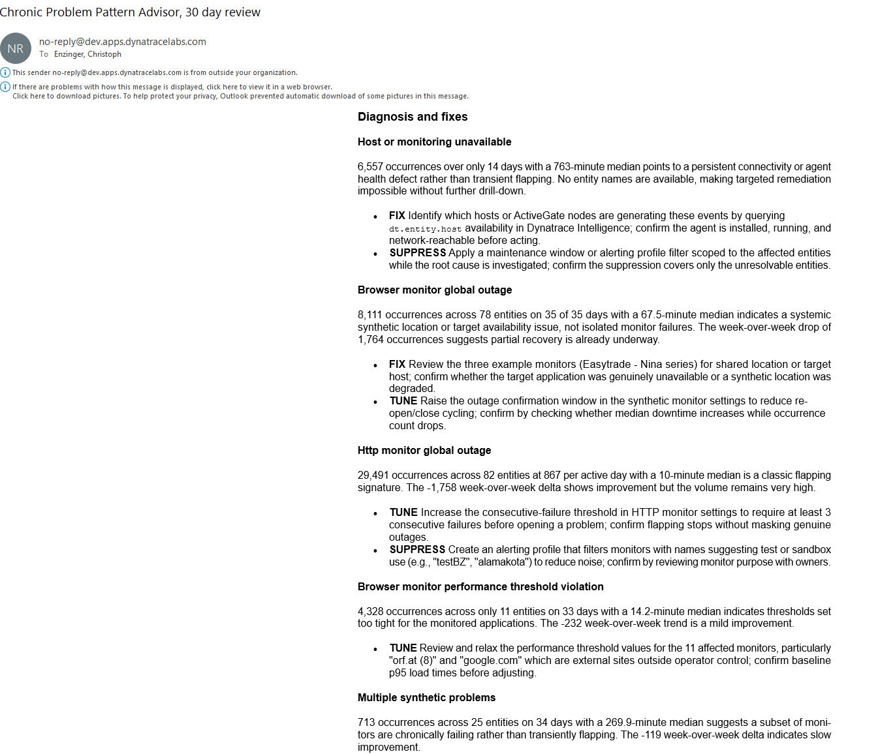

# Chronic Problem Pattern Advisor

Stop living with a problem signature that has fired 300 times because nobody added up what it costs. This workflow ranks 30 days of chronic problem signatures by accumulated downtime and tells you, for each one, whether to fix it, tune it, or suppress it — with the evidence to confirm the cause before you act.

## What it does

Weekly, this workflow runs two DQL queries against `dt.davis.problems`: the top recurring problem signatures of the last 30 days ranked by total downtime, and the same signatures compared week-over-week to show whether each pattern is growing, shrinking, or flat. Both result sets go to an agentic AI prompt task.

The agent classifies every signature as **FIX**, **TUNE**, or **SUPPRESS**, separating genuine flapping (many occurrences, short median duration) from real sustained impact, and states the specific evidence that would confirm the cause before anyone acts on it — rather than just handing over a ranked list. The recommendations are emailed automatically.

[Watch it run](https://video.dynatrace.com/watch/AAkxcC3w3Q6VYpAYyrPz8s)

> Questions or issues with this example? Open a [GitHub issue](../../issues) or ask in **#help-community-examples** on Slack.

## Screenshots

## Prerequisites

- Dynatrace tenant with Davis problems being generated (any monitored environment)
- Apps: `dynatrace.automations` (Workflows), `dynatrace.davis.workflow.actions` (Agentic AI prompt action), `dynatrace.email`
- An email connection configured for the `dynatrace.email:send-email` action

## Setup

1. Download `chronic-problem-pattern-advisor.workflow-template.yaml`.
2. In your Dynatrace environment, open **Workflows** → **Create workflow** → **Upload YAML** (or the `...` menu → **Import**) and select the file.
3. Open the `mail_report` task and set the actual **to** recipients (the template ships with empty `to`/`cc`/`bcc`).
4. Review the schedule (`0 7 * * 1`, Mondays 07:00 Europe/Vienna) and adjust the cron/timezone if needed.
5. Enable the workflow.

## Configuration

- **Recipients:** set in the `mail_report` task's `to`/`cc`/`bcc` fields.
- **Schedule:** the `trigger.schedule` block — default is weekly, Monday 07:00, `Europe/Vienna`.
- **Lookback window:** the `chronic_patterns` and `weekly_trend` DQL tasks use a 30-day window to establish chronic signatures — adjust if your team wants a shorter or longer baseline.
- **Classification thresholds:** the `advise` task's prompt defines what counts as FIX vs. TUNE vs. SUPPRESS, and how flapping is separated from real impact (occurrences per active day against median downtime) — edit this to match your team's tolerance for noise.

## Notes & limitations

- Depends on `dynatrace.davis.workflow.actions` (Agentic AI prompt action), which may require your tenant to have Davis CoPilot / Agentic AI features enabled.
- Recommendations are advisory only — the workflow does not apply any suppression or alerting-profile changes itself; a person reviews the email and acts on it.
- Works best in environments with at least a few weeks of problem history — a brand-new tenant won't have enough data to distinguish chronic patterns from noise.

## Related solutions

- [agentic-weekly-operations-report/](../agentic-weekly-operations-report/) — same agentic-report pattern, applied to a week-over-week operations summary
- [create-postmortem/](../create-postmortem/) — daily agentic postmortem drafting for the most costly resolved incident
