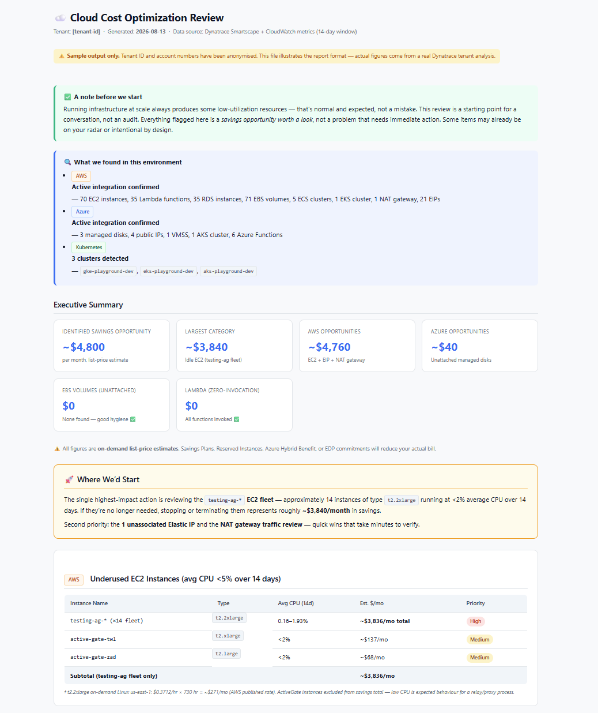

# Cloud Cost Optimization Review

Generate a customer-ready cloud cost optimization report from a Dynatrace tenant with the Cloud Native Connection enabled — in minutes, not hours.

## What it does

This example gives you two prompt variants — one for **Claude Code** (using `dtctl`), one for **Dynatrace Assist** — that analyse a customer's Dynatrace tenant for cloud cost savings opportunities and produce a polished, customer-ready HTML report you can print to PDF and hand to an AE or customer.

The prompts cover AWS and Azure idle/dangling resource detection (EBS volumes, EC2/VMs, EIPs, NAT gateways, Lambdas, managed disks), Kubernetes over-provisioning analysis, and on-demand pricing estimates — with careful logic to exclude DR/HA resources, apply the right billing model per cluster type, and write in collaborative rather than alarm-red language.

This was built and proved in the field for customer ROI conversations. It's a fast way to show how Dynatrace's Cloud Native Connection surfaces actionable cost intelligence.

> Questions or issues with this example? Open a [GitHub issue](../../issues) or ask in **#help-community-examples** on Slack.

## Screenshots

The `sample-output/` folder contains a full anonymised report so you can see exactly what the output looks like before running it on a customer environment.

## Prerequisites

- **Dynatrace tenant** with [Cloud Native Connection](https://docs.dynatrace.com/docs/shortlink/cloud-native-connection) enabled for AWS and/or Azure
- **For the Claude Code variant:** `dtctl` configured with a context for the target tenant; Claude Code installed
- **For the Dynatrace Assist variant:** Access to the Dynatrace Assist playground or a tenant with Assist enabled (no local tooling needed)
- Kubernetes over-provisioning analysis requires a K8s footprint monitored by Dynatrace

## Setup

### Option A — Claude Code (`prompt-claude-code.md`)

1. Open a terminal with Claude Code and `dtctl` available.
2. Copy the contents of `prompt-claude-code.md`.
3. Replace `<CONTEXT_NAME>` with the `dtctl` context name for the target tenant.
4. Paste into Claude Code and run.
5. Claude Code saves the report to `~/Downloads/` and opens it. Print to PDF for the customer.

### Option B — Dynatrace Assist (`prompt-dynatrace-assist.md`)

1. Open Dynatrace Assist (playground or customer tenant).
2. Paste the entire contents of `prompt-dynatrace-assist.md` as your first message.
3. When Assist pauses and asks you to continue (tool call budget limit), type **"Continue investigation"**.
4. Copy the final HTML output from Assist's response into a text editor. Save as `report.html`.
5. Open in browser. Print to PDF if needed.

> **Note:** The Assist flow requires one "Continue investigation" prompt due to tool call limits — this is a platform control, not a bug. The Claude Code variant runs end-to-end without interruption.

## Configuration

Both prompts are designed to be **run as-is** — they auto-discover which clouds and Kubernetes clusters are present before building the report. You do not need to configure cloud provider or K8s presence upfront.

The only thing to change:
- **Claude Code:** Replace `<CONTEXT_NAME>` in the prompt with the customer's `dtctl` context name.
- **Assist:** No changes needed — Assist runs against the currently open tenant.

**Output customisation:**  
The prompts include a tone and output section. If you want to adjust the report style (e.g. for a specific customer's brand or to add a Strato-styled variant), edit the `##### Tone` and `##### Output` sections of either prompt file.

## Notes & limitations

- All pricing figures are **on-demand list-price estimates**. Actual customer bills reflect Reserved Instances, Savings Plans, Azure Hybrid Benefit, or EDP discounts — the report states this explicitly.
- GCP is not covered — the Cloud Native Connection supports AWS and Azure. GKE clusters visible via Kubernetes metrics are noted but not priced.
- The Kubernetes over-provisioning section uses a 15-minute point-in-time snapshot to avoid inflation from Failed/Pending pod specs. In rare cases this query hits the tool call budget; the report includes the DQL to run manually in a Notebook.
- A Strato-styled variant of the HTML output is under development — not included here yet as it's still being refined.

## Related solutions

- [cost-intelligence-blueprints/](../../cost-intelligence-blueprints/) — for DPS cost visibility and budget alerting using Grail + workflows
