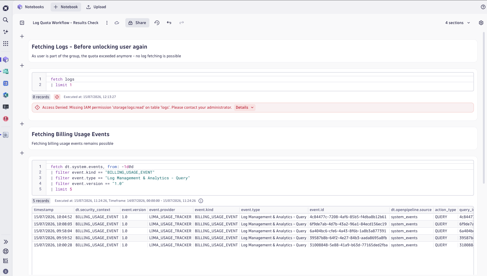
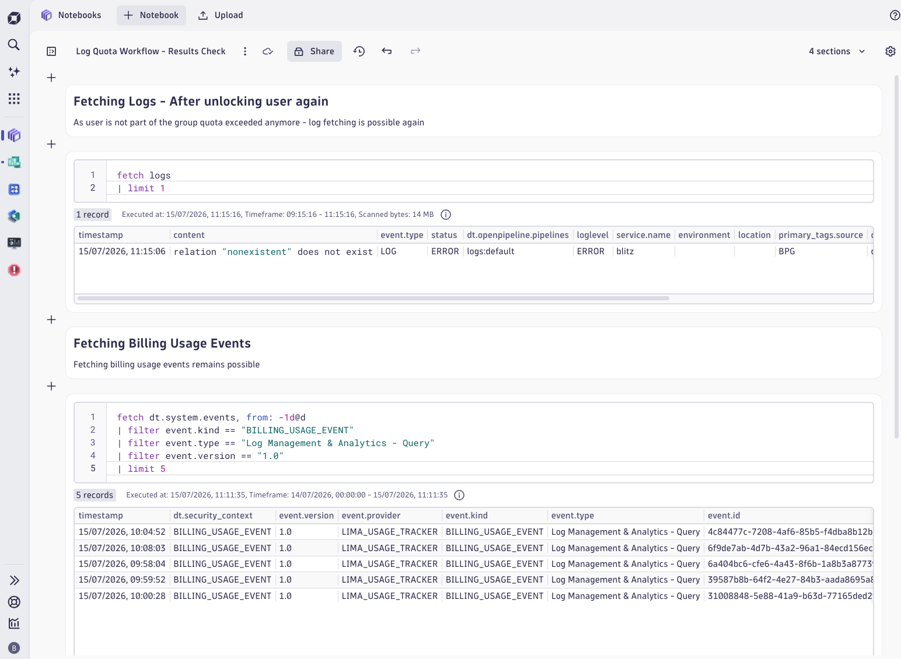
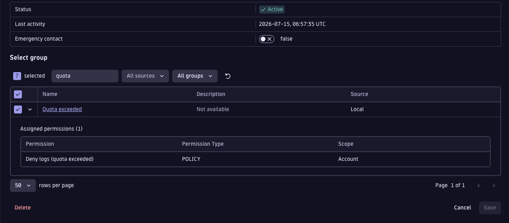

# Log Query Quota Workflow

A Dynatrace Automation workflow that enforces a daily per-user log-query quota — automatically blocking over-quota users, notifying them by email, and resetting access at midnight UTC.

## What it does

Every minute the workflow checks how much log-query volume each user has consumed today (from `dt.system.events` billing events). Any user who exceeds the configurable threshold (default: **10 TB ≈ 35 USD**) is handled in three steps:

1. Added to the **"Quota exceeded"** IAM group, which carries a `DENY storage:logs:read` policy — log queries immediately return "Access Denied"
2. Sent an email explaining the block and how to get access restored
3. Logged with a `log.quota.exceeded` business event for auditing and de-duplication (prevents repeat notifications on subsequent checks)

At **midnight UTC** a separate task removes all users from the group so everyone starts the next day with a clean slate. Admins can also unlock a user early by manually removing them from the group.

**Workflow task chain:**

```
quota_reset_at_midnight  (runs only at 00:00 UTC, parallel)
check_for_log_quota      (runs every minute)
  → lock_out_users           (when quota is exceeded)
  → send_email_about_log_quota (when quota is exceeded)
```

## Screenshots

### Quota enforced — log queries blocked, billing events still accessible



### Access restored after removing user from the group



### User added to "Quota exceeded" group with deny policy



## Prerequisites

- Dynatrace SaaS tenant with Automation Workflows and the `dynatrace.email` connector enabled
- Account Management access to create IAM policies, groups, service users, and OAuth clients
- The `dynatrace.automations ^1.3208.0` and `dynatrace.email ^1.10.8` apps available in your environment

See [SETUP.md](SETUP.md) for the full step-by-step instructions.

## Setup

The setup takes roughly 15 minutes and involves six steps:

1. Create two IAM policies — one to deny log reads, one for the workflow to run with
2. Create the **"Quota exceeded"** group and attach the deny policy
3. Create a service user **"Quota Exceeded Check User"** as the workflow actor
4. Create an OAuth client (requires an account manager as the subject user)
5. Store the OAuth credentials in the Credential Vault as **"Quota check OAuth"**
6. Import `workflow.yaml` and set the actor to the service user

## Configuration

The following values can be adjusted without changing the workflow code:

| What | Where | Default |
|------|-------|---------|
| Daily log-query quota | `check_for_log_quota` task — edit the `filter query_volume >` line | `10 * 1024 * 1024 * 1024 * 1024` (10 TB) |
| Reset time | `quota_reset_at_midnight` step condition | `00:00` UTC |
| Notification email text | `send_email_about_log_quota` task — `content` field | See workflow |

To apply a quota to specific users only, add a `filterOut` clause to the DQL in `check_for_log_quota`. For weekly or monthly quotas, change the `from: -1d@d` timeframe and adjust the threshold accordingly.

## Notes & limitations

- Billing events (`dt.system.events`) are available from the day after ingestion — the quota check reflects usage up to the current day's events as they arrive.
- The `log.quota.exceeded` business event is used as a de-duplication gate: users who are already blocked are not notified again within the same day.
- Grail data is immutable — if the workflow runs more than once for the same day, duplicate audit events will be written. This does not affect enforcement.
- The workflow requires an OAuth client with a **real account manager** as the subject user (service users cannot act as OAuth subjects).
