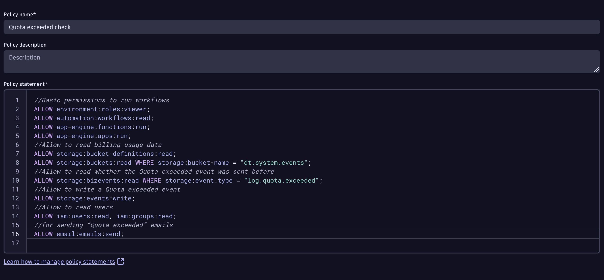
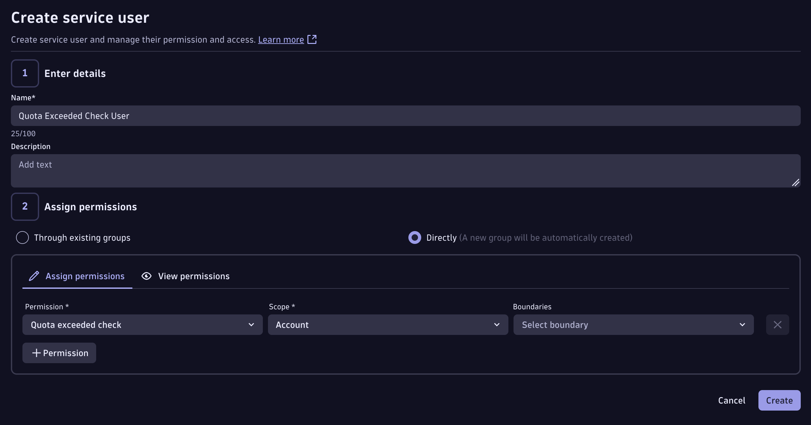
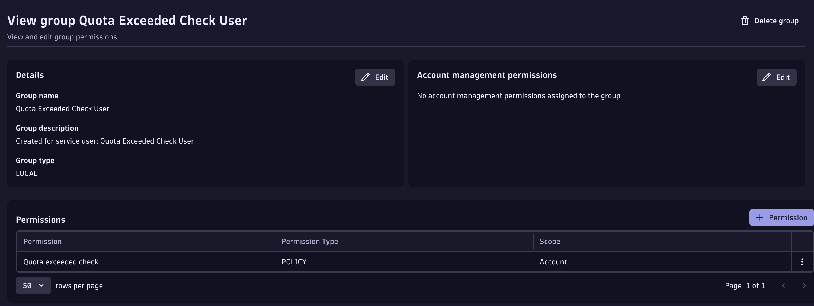

# Workflow Setup

Deploy the `Log Quota check` Dynatrace Automation workflow to automatically enforce daily per-user log-query quotas.

---

## 1. Create the IAM policies

**Where:** `account.dynatrace.com` - Identity & Access Management - Policy Management

Two policies are required.

### 1a — Policy to deny log reads

This policy is attached to the "Quota exceeded" group. Any user in that group loses `storage:logs:read` access.

| Field | Value |
|-------|-------|
| Policy name | `Deny logs (quota exceeded)` |
| Policy statement | `DENY storage:logs:read;` |

### 1b — Policy the workflow runs with

This policy is assigned to the service user (step 3) and grants the workflow the exact permissions it needs — nothing more.

| Field | Value |
|-------|-------|
| Policy name | `Quota exceeded check` |
| Scope | Account |

Policy statement:

```
//Basic permissions to run workflows
ALLOW environment:roles:viewer;
ALLOW automation:workflows:read;
ALLOW app-engine:functions:run;
ALLOW app-engine:apps:run;
//Allow to read billing usage data
ALLOW storage:bucket-definitions:read;
ALLOW storage:buckets:read WHERE storage:bucket-name = "dt.system.events";
//Allow to read whether the Quota exceeded event was sent before
ALLOW storage:bizevents:read WHERE storage:event.type = "log.quota.exceeded";
//Allow to write a Quota exceeded event
ALLOW storage:events:write;
//Allow to read users
ALLOW iam:users:read, iam:groups:read;
//for sending "Quota exceeded" emails
ALLOW email:emails:send;
```



---

## 2. Create the "Quota exceeded" group

**Where:** `account.dynatrace.com` - Identity & Access Management - Group Management

| Field | Value |
|-------|-------|
| Group name | `Quota exceeded` |

> **The name must be exactly `Quota exceeded`** — the workflow looks it up by name at runtime.

Under **Permissions**, add the `Deny logs (quota exceeded)` policy with scope **Account**.

---

## 3. Create the service user

**Where:** `account.dynatrace.com` - Identity & Access Management - Service Users

| Field | Value |
|-------|-------|
| Service user name | `Quota Exceeded Check User` |
| Assign permissions | Directly (not through existing groups) |
| Permission | `Quota exceeded check` |
| Scope | Account |

Save the service user's **email address** — you will need it in steps 5 and 6.



When you create the service user with direct permissions, Dynatrace automatically creates a companion group ("Quota Exceeded Check User") with the `Quota exceeded check` policy attached:



---

## 4. Create the OAuth client

**Where:** `account.dynatrace.com` - Identity & Access Management - OAuth clients

The OAuth client lets the workflow call the IAM API to add and remove users from the "Quota exceeded" group.

| Field | Value |
|-------|-------|
| Subject user email | A real user with the **Account Manager** permission |
| Permissions - Account | `View users and groups` and `Manage users and groups` |

> **The service user cannot be the subject user.** The subject must be a real account with Account Manager rights.

Save the **client secret** and the **last part of the account URN** (visible in the URL: `account.dynatrace.com/accounts/{account-uuid}/...`) — the client secret is shown only once.

---

## 5. Store the credentials in the Credential Vault

**Where:** Your Dynatrace environment - Credential vault - Add new credential

| Field | Value |
|-------|-------|
| Type | User and Password |
| Name | `Quota check OAuth` |
| User name | Last part of the account URN (the UUID) |
| Password | The full client secret (e.g. `dt0s02.XXXXXXXX.LONG_SECRET_STRING`) |
| Scope | AppEngine — apps with access: Workflows — "Allow access without app context" |
| Users with access | The service user email from step 3 |

> **The name must be exactly `Quota check OAuth`** — the workflow searches for it by name.

---

## 6. Import the workflow

**Where:** Your Dynatrace environment - Automation - Workflows - Upload

1. Upload `workflow.yaml`
2. After importing, set the **Actor** to `Quota Exceeded Check User`
3. Run the workflow manually once to confirm all steps pass

**Workflow task chain:**

```
quota_reset_at_midnight  (parallel, runs only when time == 00:00 UTC)
check_for_log_quota      (runs every minute)
  → lock_out_users           (condition: records returned > 0)
  → send_email_about_log_quota (condition: records returned > 0)
```

The `lock_out_users` and `send_email_about_log_quota` tasks only execute when `check_for_log_quota` returns at least one record. If no user has exceeded the quota, the workflow completes silently.

---

## Validation

After setup, you can validate enforcement by running the DQL from `check_for_log_quota` directly in a Notebook or DQL query. A user over quota should:

1. Appear in the DQL results
2. Be added to the "Quota exceeded" group after the next workflow run
3. Receive "Access Denied" on `fetch logs` queries while in the group


Remove the user from the group (or wait for the midnight reset) to restore access:


