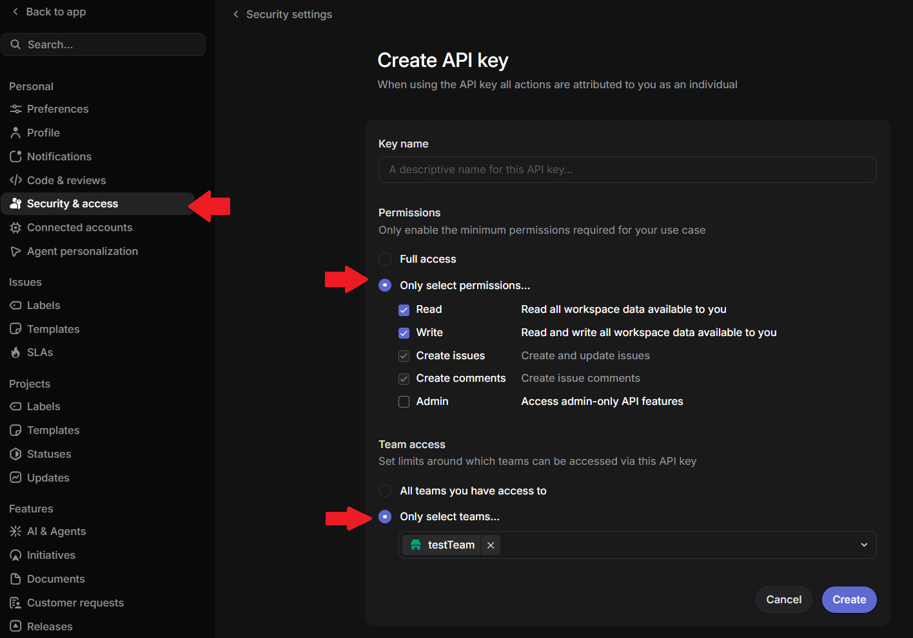
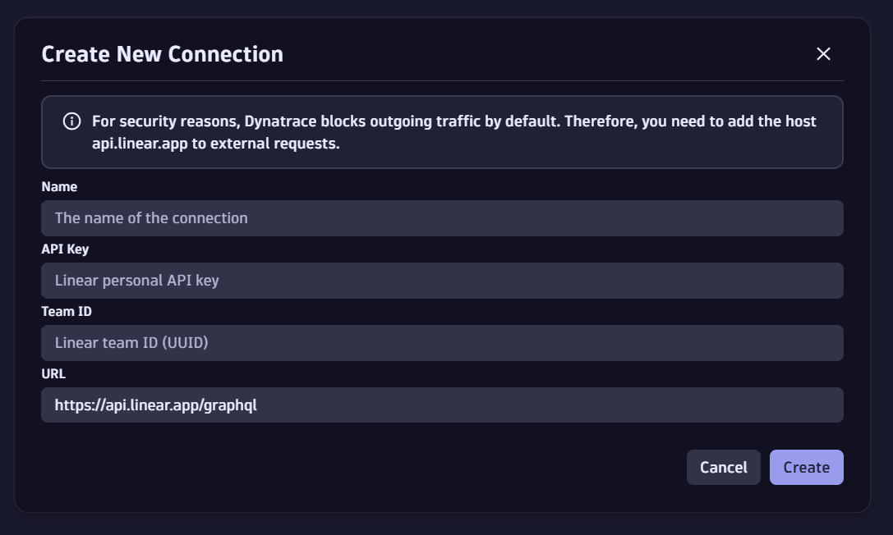
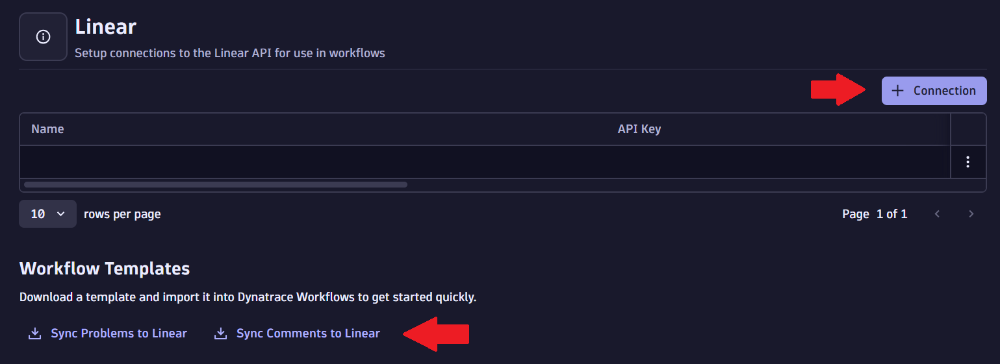
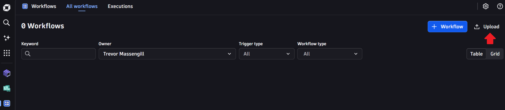

# Linear Connector for Dynatrace Workflows

Connect Linear with Dynatrace using this Workflow Connector app. It syncs Dynatrace problems to Linear issues and keeps comments in sync between both platforms — so your engineering team can track incidents in Linear without leaving their workflow.

---

## ✨ Features

- **Sync problems:** automatically create or update a Linear issue whenever a Dynatrace problem fires
- **Sync comments (Dynatrace → Linear):** push new Dynatrace problem comments to their corresponding Linear issue
- **Sync comments (Linear → Dynatrace):** pull new Linear issue comments back into the Dynatrace problem
- **Loop prevention:** tagged comments and hidden markers prevent the same comment from bouncing back and forth
- **Multiple connections:** manage one connection per Linear team from the app's Home page

The app provides three Automation Workflow actions:

| Action | Direction | What it does |
|---|---|---|
| **Linear Sync Problems** | Dynatrace → Linear | Takes a single Dynatrace problem event and creates or updates the corresponding Linear issue. |
| **Linear Sync Dynatrace Comments** | Dynatrace → Linear | Scans Dynatrace problem comments within a timeframe and pushes any not already synced to their corresponding Linear issue. |
| **Linear Sync Issue Comments** | Linear → Dynatrace | For Linear issues updated within a timeframe, pushes new Linear comments to their corresponding Dynatrace problem. |

---

## 🚀 Install the app on the Dynatrace platform

*Linear Connector for Dynatrace Workflows is available as a Dynatrace app to all customers upon request.*

1. *Linear Connector for Dynatrace Workflows* is delivered via a [Hub subscription](https://docs.dynatrace.com/docs/shortlink/hub#add-subscription). Email [community-apps@dynatrace.com](mailto:community-apps@dynatrace.com) with your account name and tenant ID, as described [here](https://github.com/Dynatrace/community-examples/blob/main/dynatrace-apps/README.md).
2. We'll process your request and send instructions for subscribing to the channel and installing the app.
3. After installation, open the app from the Dynatrace App Launcher to manage connections and import workflow templates.

---

## ⚙️ Configuration

### 1. Get a Linear API key

The app authenticates to Linear with a single bearer token sent as the `Authorization` header on every GraphQL call.

**Create a Personal API Key**: Linear → Settings → Account → **Security & Access** → Personal API keys → New API key.

When creating the key, Linear lets you pick specific permissions and restrict it to specific teams:

- **Read** — needed to find matching issues and pull existing comments.
- **Write** — needed to create/update issues and post comments. (**Create issues** / **Create comments** alone are *not* enough, since this app also *updates* existing issues.)
- **Restrict to the target team** — no reason to grant broader access than the team it's syncing to.
- Leave **Admin** unchecked — nothing in this app needs it.

Also grab while you're in Linear:
- **Team ID** (UUID) of the team issues should be created in.

### 2. Set up the connection in Dynatrace

1. Open the app → **Home** page → **+ Connection**:
   - **Name** — a friendly label you'll pick from later when configuring workflow tasks
   - **API Key** — the Linear personal API key from step 1
   - **Team ID** — the Linear team UUID from step 1
   - **URL** — leave as `https://api.linear.app/graphql` unless you have a specific reason to change it
2. Save. You can create multiple named connections (e.g. one per Linear team) and edit/delete them later from the same table.

> **Note:** Allow-list outbound traffic to `api.linear.app` in your Dynatrace environment — Dynatrace blocks outbound requests by default and every Linear call will fail until this host is allow-listed.

### 3. Import the workflow templates

The Home page has a **Workflow Templates** section with two downloadable YAML templates — download each, then in Dynatrace go to **Workflows → Import**.

#### Workflow A — "Sync Problems to Linear"
- **Trigger:** Davis problem event trigger. Ships with `customFilter: matchesPhrase(event.name, "linear")` as a placeholder — replace it with whatever actually identifies the problems you want synced (e.g. an entity tag).
- **Task:** runs **Linear Sync Problems** with `event: '{{event()}}'`.
- After import: set the workflow's **connection** input to the connection you created above.

#### Workflow B — "Sync Comments to Linear"
- **Trigger:** a 5-minute schedule, included by default.
- **Tasks:** runs **Linear Sync Dynatrace Comments** and **Linear Sync Issue Comments** in parallel.
- Both tasks' `from` input defaults to a 5-minute lookback — see the timeframe note below, since **the two tasks use different syntax**.
- Set the **connection** input on both tasks to your saved connection.

---

## 🖥️ Using the workflow actions

### Timeframes — two different syntaxes

The two comment-sync tasks send their `from`/`to` inputs to two different APIs, which expect two different formats. Getting this wrong is the most common setup mistake.

- **Linear Sync Dynatrace Comments** — its `from`/`to` go straight into a **Dynatrace DQL** query. Use DQL timeframe syntax, e.g. `now()-5m`.
  📖 [Dynatrace Query Language guide](https://docs.dynatrace.com/docs/platform/grail/dynatrace-query-language/dql-guide)
- **Linear Sync Issue Comments** — its `from`/`to` go straight into a **Linear GraphQL** filter. Use an ISO 8601 duration relative to now, e.g. `-PT5M` (5 minutes ago) — not DQL syntax.
  📖 [Linear API filtering documentation](https://linear.app/developers/filtering)

In both cases, the timeframe should match or exceed how often the workflow runs, or comments created between runs can be missed.

### How comment syncing avoids loops and duplicates

- Comments pushed **to** Dynatrace by **Linear Sync Issue Comments** are tagged with `annotation.source: "Linear"`. **Linear Sync Dynatrace Comments** excludes these when scanning — otherwise a Linear comment synced into Dynatrace would get picked up and posted right back to Linear.
- Dynatrace → Linear comments carry a `*Synced automatically via Dynatrace Automation Workflows.*` footer and a hidden `<!-- dt-event-id: ... -->` marker, used to detect and skip already-synced comments on later runs.
- Author attribution is resolved to real display names: Dynatrace user IDs are looked up via IAM, Linear comments already carry the author's name.

### How problem–issue matching works

Matching between a Dynatrace problem and a Linear issue is done by embedding the Dynatrace `event.id` in the issue **description** as a markdown table row (`| Event ID | \`<id>\` |`), then searching and parsing that back out — there is no separate mapping store. If a problem was never synced to Linear (no matching issue), its comments are simply skipped and logged, not treated as an error.
