# Dynatrace on Rafay-managed Kubernetes

> Deploy Dynatrace Operator, DynaKube, and monitoring tokens as a Rafay golden cluster blueprint, so every cluster in a fleet is observable from the moment it is provisioned.

## What it does

Platform teams running fleets of Kubernetes clusters on the [Rafay Platform](https://rafay.co) usually instrument clusters one at a time, which leaves gaps and drift. This blueprint packages Dynatrace as three versioned Rafay add-ons inside a Golden Blueprint, so observability becomes part of the platform baseline every cluster inherits rather than a day-2 task.

One blueprint serves the whole fleet. Cluster identity is injected through Rafay cluster variables at sync time, so only two things vary per environment: the tokens in `tokens-secret.yaml` and a `dtEnvId` cluster label. Operator upgrades and configuration changes become new blueprint versions that can be published progressively and rolled back per cluster.

Coverage delivered in a single sync: Kubernetes platform monitoring, application observability, log monitoring, OTLP telemetry ingest, and Kubernetes Security Posture Management (KSPM).

## Screenshots

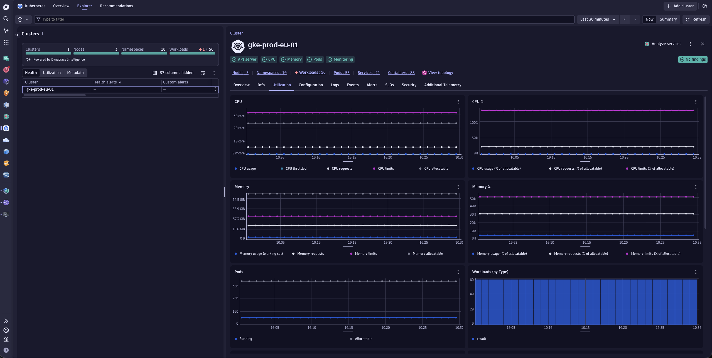
*A Rafay-managed GKE cluster in the Dynatrace Kubernetes app — nodes, namespaces, and workloads discovered automatically.*

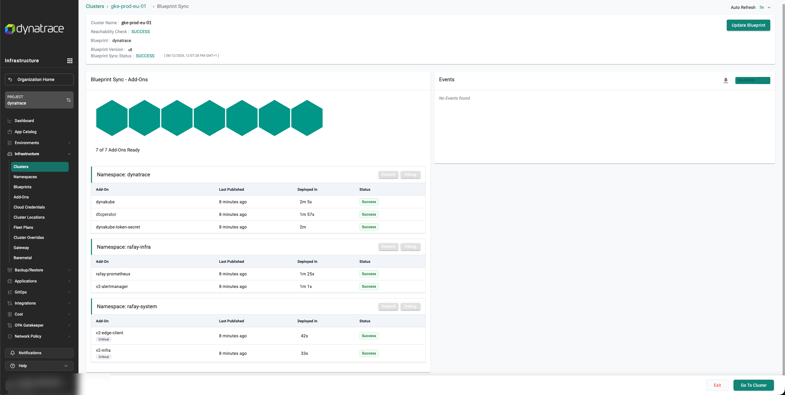
*Blueprint sync complete, all add-ons ready. The whole Dynatrace stack deploys in roughly two minutes.*

## Components

| Order | Add-on | Rafay type | File in this folder | Depends on |
|---|---|---|---|---|
| 1 | `dtoperator` | Helm 3 — Helm repo | [`operator-values.yaml`](./operator-values.yaml) | — |
| 2 | `dynakube-token-secret` | K8s YAML | [`tokens-secret.yaml`](./tokens-secret.yaml) | `dtoperator` |
| 3 | `dynakube` | K8s YAML | [`dynakube.yaml`](./dynakube.yaml) | `dynakube-token-secret` |

All three deploy into the `dynatrace` namespace and are assembled into one Golden Blueprint.

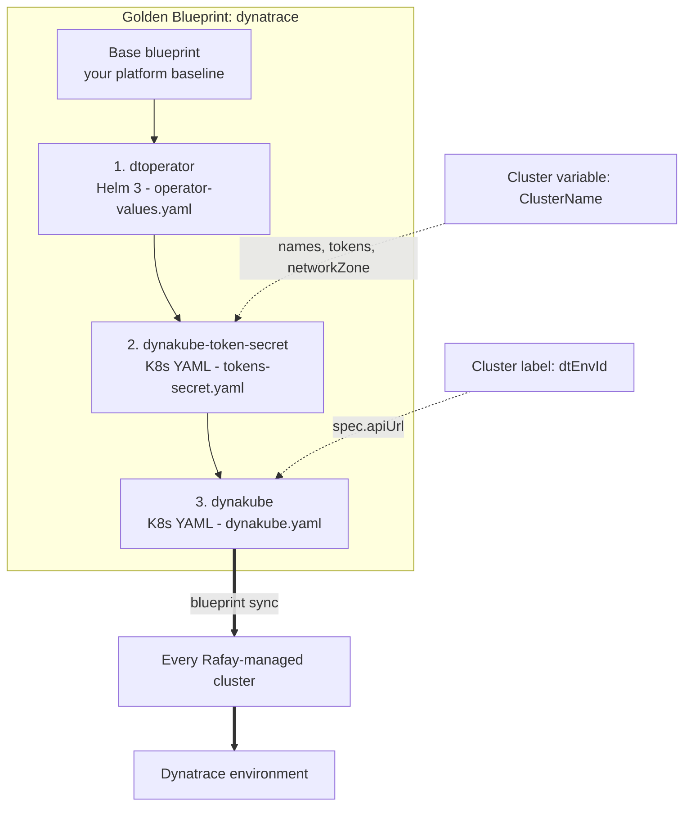

## Prerequisites

- **Dynatrace environment** — SaaS environment ID (for example `abc12345`), used to build `spec.apiUrl`.
- **Access tokens** — an operator token and a data-ingest token. Use the `Kubernetes: Dynatrace Operator` and `Kubernetes: Data Ingest` templates so the required scopes are applied. See [Access tokens and permissions](https://docs.dynatrace.com/docs/ingest-from/setup-on-k8s/deployment/tokens-permissions).
- **Rafay permissions** — a project in which you can manage Repositories, Add-Ons, Blueprints, and Clusters. Screenshots were taken on Rafay Controller v3.1.
- **Clusters** — one or more clusters imported into or provisioned by Rafay, on a [supported distribution](https://docs.dynatrace.com/docs/ingest-from/setup-on-k8s/deployment/supported-technologies).
- **Connectivity** — outbound access from cluster nodes to the Dynatrace environment and to the chart and image registries in use.

> [!NOTE]
> Every chart, image, and API version referenced here is an example that was current when the screenshots were taken. Check the [Dynatrace Operator release notes](https://docs.dynatrace.com/docs/whats-new/dynatrace-operator) for the current release before adopting.

## Setup

<details>
<summary><b>First, choose how to source Dynatrace Operator — App Catalog or custom Helm repository</b></summary>

Rafay can source the operator from its own curated App Catalog or from a Helm repository you register yourself.

| Requirement | App Catalog add-on | Custom Helm repository |
|---|---|---|
| Time to first deployment | Fastest, no repository setup | One-time repository setup |
| Pin an exact chart version | Only indexed versions | Any published version |
| Access to newest operator release | Waits for catalog refresh | Immediate |
| Private / air-gapped registry | Not supported | Endpoint, CA certificate, credentials |
| Custom values file | Editable, re-applied per version | Uploaded, or pulled from Git |
| Helm options (atomic, hooks, history) | Limited | Full control |
| Change control and auditability | Catalog-driven | Versioned add-on, optional Git source of truth |
| Best fit | Proof of concept, lab, single cluster | Production fleets, regulated and air-gapped estates |

**App Catalog** is the fast path: search the catalog for *Dynatrace*, open `dynatrace-operator` from the `default-helm` catalog, and choose **Create Add-On**. Catalog indexing lags upstream chart releases, so the newest operator version may not be selectable, and air-gapped environments cannot reach the catalog endpoint at all.

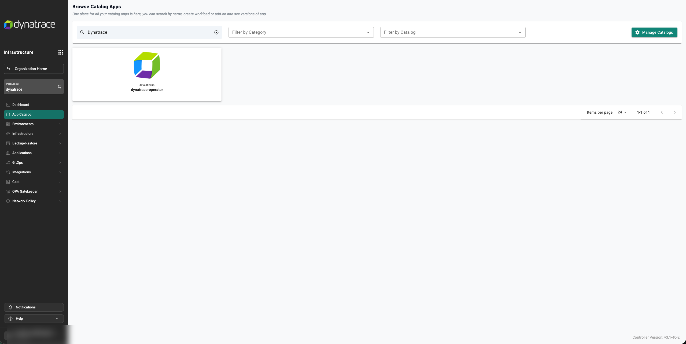

**Custom Helm repository** is the recommended option for production and is what the steps below use. It pins the exact chart version, keeps the values file under your control, and is reproducible through the Rafay RCTL CLI or a GitOps pipeline.

If you use the App Catalog instead, skip steps 1 and 2 and continue from step 3.

</details>

### 1. Register the Dynatrace Helm repository

Go to **Integrations › Repositories › New Repository**. Name it `dynatrace-repo` and set **Type** to **Helm**. Open the repository and set the endpoint:

```text
oci://public.ecr.aws/dynatrace/
```

Set **Reachability** to **Internet** for the public registry, or **Private Network** for an internal mirror. Add a PEM-format **CA Certificate** if the repository presents a private certificate, and **Credentials** if it is not anonymously readable. Public repositories require neither.

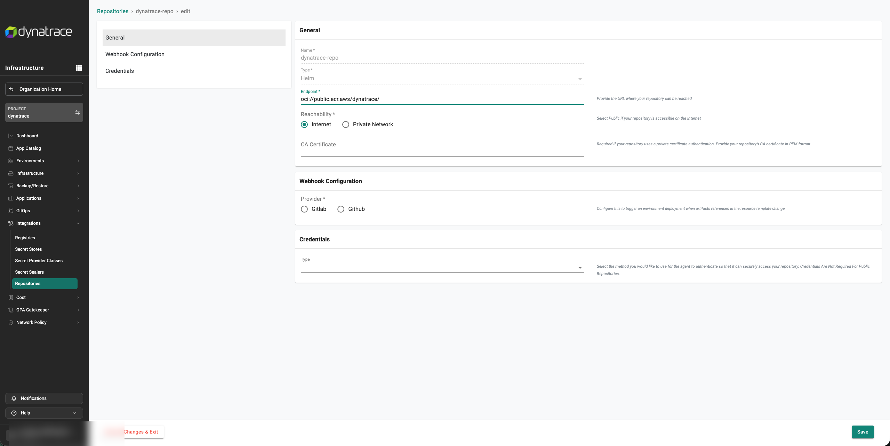

### 2. Create the Dynatrace Operator add-on

Go to **Infrastructure › Add-Ons › New Add-On › Create New Add-On** and select **Bring your own**:

| Field | Value |
|---|---|
| Name | `dtoperator` |
| Type | `Helm 3` |
| Artifact Sync | Pull files from repository |
| Repository Type | Helm |
| Namespace | `dynatrace` |

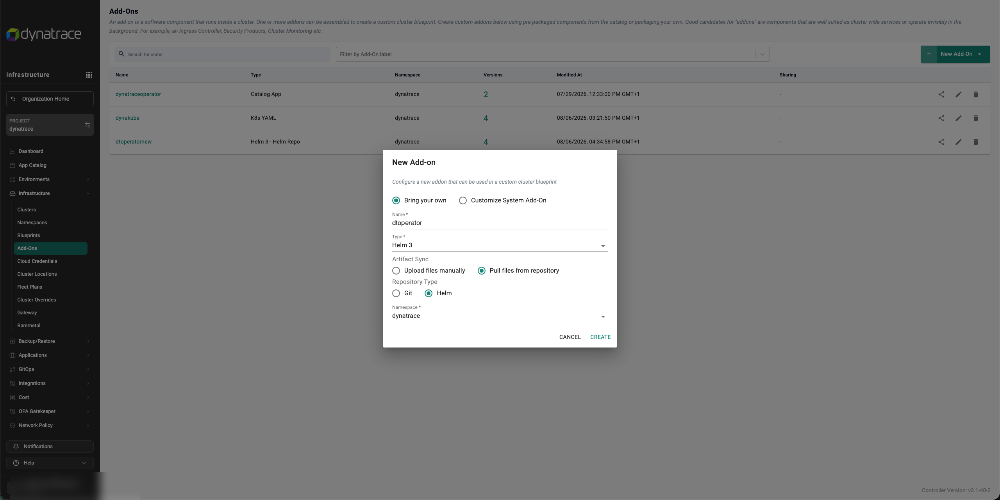

Add a version to the add-on:

| Field | Value |
|---|---|
| Version Name | Name it after the chart version being pinned, for example `v1.10.2` |
| Repository | `dynatrace-repo` |
| Chart Name | `dynatrace-operator` |
| Chart Version | The version you intend to run, for example `1.10.2` |
| Values File(s) | Upload [`operator-values.yaml`](./operator-values.yaml), or select **Override from git repository** |
| Helm Options | Enable **Atomic** so a failed install rolls back cleanly |

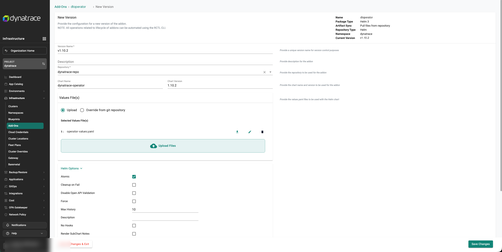

> [!IMPORTANT]
> **GKE is the exception on image source.** On GKE and GKE Autopilot the operator image must be pulled from the Dynatrace GKE Marketplace repository. In `operator-values.yaml`, set `imageRef.repository` to `gcr.io/dynatrace-marketplace-prod/dynatrace-operator` for those clusters only, and leave it empty elsewhere so the same file stays portable across the rest of the fleet.

> [!TIP]
> **Why the CSI driver is disabled.** `operator-values.yaml` sets `csidriver.enabled: false`. Recent operator versions do not use the CSI driver by default, but it is still installed unless you opt out. Disabling it removes an unused component, and with it the elevated privileges it requires — which matters on managed node pools. Enable it only for the deployment modes that need it. See [Dynatrace Operator components](https://docs.dynatrace.com/docs/ingest-from/setup-on-k8s/how-it-works/components/dynatrace-operator).

### 3. Create the token secret add-on

Create an add-on named `dynakube-token-secret` with **Type** `K8s YAML`, **Artifact Sync** *Upload files manually*, and **Namespace** `dynatrace`. Upload [`tokens-secret.yaml`](./tokens-secret.yaml).

The `Secret` is named after the cluster, so the DynaKube resources can reference it through the same variable:

```yaml
apiVersion: v1
stringData:
  apiToken: <OPERATOR_TOKEN>
  dataIngestToken: <INGEST_TOKEN>
kind: Secret
metadata:
  name: {{{ .global.Rafay.ClusterName }}}
  namespace: dynatrace
type: Opaque
```

Create **one version per token set** — for example `prod` and `NonProd`. Pointing a cluster at a different Dynatrace environment then becomes a version selection, and token rotation is a version bump with no DynaKube change.

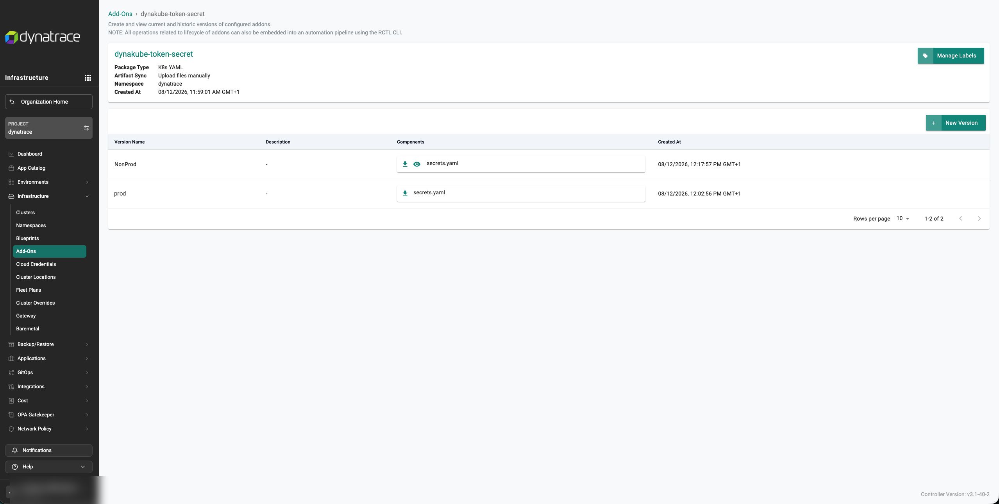

> [!WARNING]
> Uploading the manifest above stores token values in a Rafay add-on version. It is shown this way for simplicity. For secure best practice, reference the tokens instead of embedding them, using a Rafay **Secret Store**, **Secret Provider Class**, or **Secret Sealer** (under **Integrations**) so plaintext tokens are never held in Rafay. The rest of the pattern is unchanged.

### 4. Create the DynaKube add-on

Create an add-on named `dynakube`, again **K8s YAML** in the `dynatrace` namespace, and upload [`dynakube.yaml`](./dynakube.yaml). It contains the DynaKube resources for platform monitoring, KSPM, application observability, log monitoring, and telemetry ingest.

The Rafay-specific part is the header of each resource, where cluster identity comes from variables rather than hard-coded values:

```yaml
apiVersion: dynatrace.com/v1beta6
kind: DynaKube
metadata:
  name: {{{ .global.Rafay.ClusterName }}}
  namespace: dynatrace
  annotations:
    feature.dynatrace.com/k8s-app-enabled: "true"
spec:
  apiUrl: https://{{{ .global.Rafay.ClusterLabels.dtEnvId }}}.apps.dynatrace.com/api
  tokens: {{{ .global.Rafay.ClusterName }}}
  networkZone: Rafay-{{{ .global.Rafay.ClusterName }}}
```

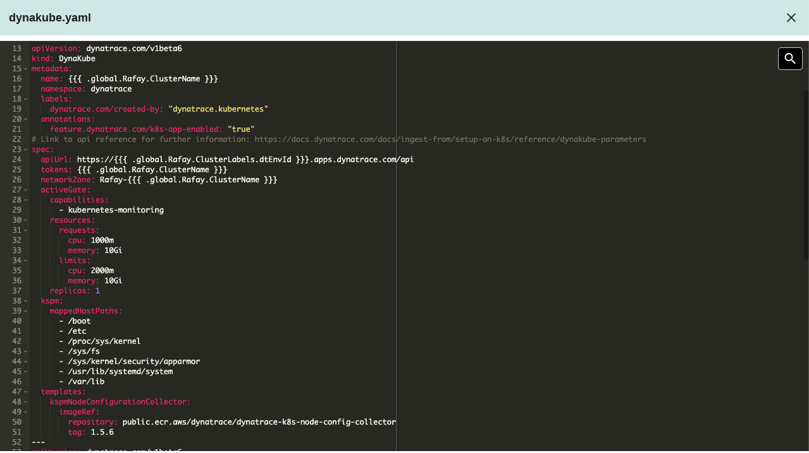

Everything below `spec` is standard Dynatrace configuration rather than Rafay-specific. For available settings see [DynaKube parameters](https://docs.dynatrace.com/docs/ingest-from/setup-on-k8s/reference/dynakube-parameters) and [DynaKube feature flags](https://docs.dynatrace.com/docs/ingest-from/setup-on-k8s/reference/dynakube-feature-flags); to choose a monitoring mode, start at [Deployment](https://docs.dynatrace.com/docs/ingest-from/setup-on-k8s/deployment).

Conventions worth keeping consistent across the fleet:

- Pin image tags rather than using `latest`, so blueprint versions stay reproducible.
- Set a [`networkZone`](https://docs.dynatrace.com/docs/ingest-from/setup-on-k8s/guides/networking-security-compliance/network-zones) per cluster to keep ActiveGate traffic local and identifiable.
- Keep `feature.dynatrace.com/k8s-app-enabled: "true"` so the cluster appears in the Dynatrace Kubernetes app.
- Split platform monitoring and application monitoring into separate DynaKube resources — they scale and fail independently.

### 5. Assemble the Golden Blueprint

Go to **Infrastructure › Blueprints › New Blueprint**, name it `dynatrace`, and select **Golden Blueprint** so it can be shared and enforced across projects.

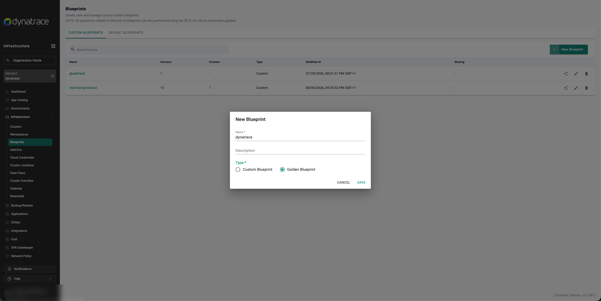

Create a version and select the **Base Blueprint**. The screenshots use `default`, but this should be whichever blueprint reflects your own platform baseline — ingress, policy, logging agents, and any other cluster-wide services you standardise on. Building the Dynatrace add-ons onto that base is what puts observability into the image every cluster inherits, ahead of the customisations individual teams apply later.

Select **Configure Add-Ons**, associate the three add-ons with their versions, and set the **Dependencies** field so ordering is deterministic:

- `dtoperator` — no dependencies, installs first
- `dynakube-token-secret` — depends on `dtoperator`
- `dynakube` — depends on `dynakube-token-secret`

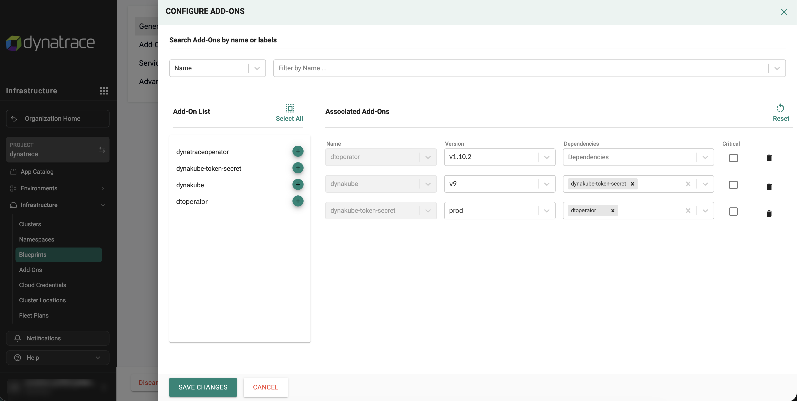

> [!CAUTION]
> Without these dependencies, Rafay can apply the DynaKube resources before the operator has registered its CRDs and admission webhook, and the add-on fails on first sync. Do not mark the Dynatrace add-ons **Critical** unless a Dynatrace failure should block the entire blueprint sync.

### 6. Label each cluster with its Dynatrace environment ID

`spec.apiUrl` resolves from a cluster label, which is what allows one blueprint to target several Dynatrace environments. On each cluster, open the actions menu, select **Edit Labels**, and add:

| Key | Value | Resolves to |
|---|---|---|
| `dtEnvId` | The Dynatrace environment ID, for example `abc12345` | `https://abc12345.apps.dynatrace.com/api` |

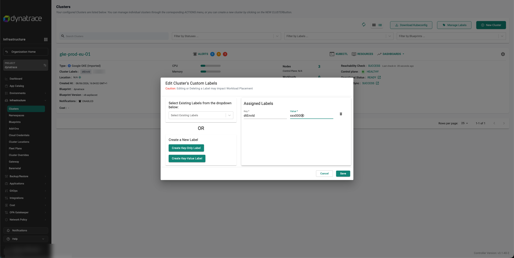

> [!NOTE]
> Values that flow into `metadata.name`, `networkZone`, and the token `Secret` name must be valid Kubernetes resource names. Keep cluster names and label values lower-case alphanumeric, and avoid leading, trailing, or doubled separator characters. Validate a new naming convention on one cluster before fleet rollout.

### 7. Publish the blueprint

**Existing clusters** — from **Infrastructure › Clusters**, open the cluster actions menu, select **Update Blueprint**, choose the blueprint and version, then **Save and Publish**. Use **Force sync** only to re-apply an unchanged version.

**New clusters** — select the blueprint and version in **General Configuration** at creation or import time. Choose an explicit version rather than *Latest* for production, so a new blueprint version never lands unreviewed. For imported clusters, Rafay then walks through registration: download the bootstrap YAML, apply it with `kubectl`, and the cluster progresses through check-in, namespace sync, and blueprint sync — installing Dynatrace on the way.

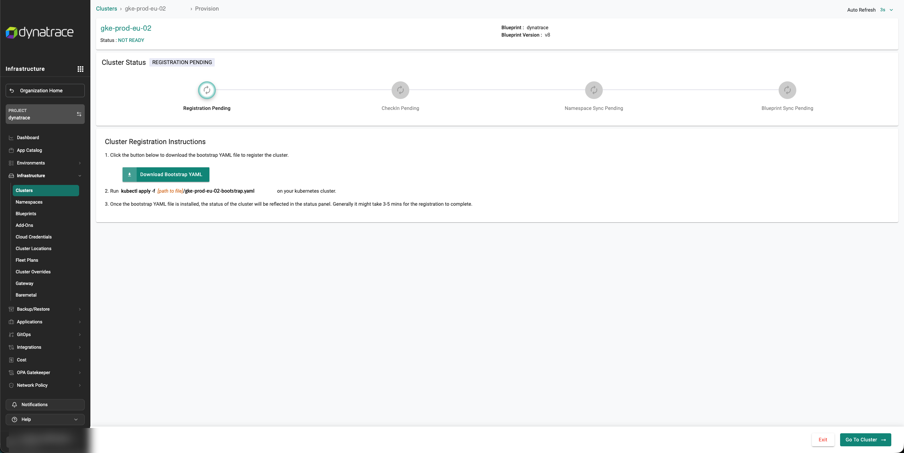

### 8. Verify

In Rafay, the **Blueprint Sync** page reports each add-on per namespace and should report **SUCCESS** with all add-ons ready. Then open **Resources** on the cluster, or the namespace summary, and confirm:

- the operator and webhook deployments are `Running` (webhook `2/2` for high availability)
- one ActiveGate StatefulSet per DynaKube, at the expected replica count
- the node configuration collector DaemonSet has one pod per node
- images match the versions pinned in the add-on

A healthy namespace looks like the following. Cluster name, image tags, and pod hashes will differ in your environment; this example is from a three-node cluster.

```text
$ kubectl get all -n dynatrace

NAME                                             READY   STATUS    RESTARTS   AGE
pod/dynatrace-operator-<hash>                    1/1     Running   0          11h
pod/dynatrace-webhook-<hash>                     1/1     Running   0          11h
pod/dynatrace-webhook-<hash>                     1/1     Running   0          11h
pod/<cluster>-activegate-0                       1/1     Running   0          11h
pod/<cluster>-agents-activegate-0                1/1     Running   0          11h
pod/<cluster>-agents-activegate-1                1/1     Running   0          11h
pod/<cluster>-agents-activegate-2                1/1     Running   0          11h
pod/<cluster>-agents-otel-collector-0            1/1     Running   0          11h
pod/<cluster>-node-config-collector-<hash>       1/1     Running   0          11h
pod/<cluster>-node-config-collector-<hash>       1/1     Running   0          11h
pod/<cluster>-node-config-collector-<hash>       1/1     Running   0          11h

NAME                                        TYPE        PORT(S)
service/dynatrace-webhook                   ClusterIP   443/TCP
service/<cluster>-activegate                ClusterIP   443/TCP,80/TCP
service/<cluster>-agents-activegate         ClusterIP   443/TCP,80/TCP
service/telemetry-ingest                    ClusterIP   14250/TCP,6832/UDP,6831/UDP,4317/TCP,4318/TCP,8125/UDP,9411/TCP

NAME                                              DESIRED   READY   CONTAINERS
daemonset.apps/<cluster>-node-config-collector     3         3      node-config-collector

NAME                                 READY   CONTAINERS
deployment.apps/dynatrace-operator   1/1     operator
deployment.apps/dynatrace-webhook    2/2     webhook

NAME                                                 READY   CONTAINERS
statefulset.apps/<cluster>-activegate                1/1     activegate
statefulset.apps/<cluster>-agents-activegate         3/3     activegate
statefulset.apps/<cluster>-agents-otel-collector     1/1     collector
```

Check the `IMAGES` column of the same output (omitted above for width) to confirm the operator, ActiveGate, OTel collector, and node configuration collector images match the versions you pinned.

In Dynatrace, open the **Kubernetes** app and confirm:

- the cluster appears, under network zone `Rafay-<cluster-name>`
- **Security** shows [Kubernetes security posture](https://docs.dynatrace.com/docs/ingest-from/setup-on-k8s/deployment/security-posture-management) findings
- **Logs** contains records from the cluster — see [Kubernetes log monitoring](https://docs.dynatrace.com/docs/ingest-from/setup-on-k8s/deployment/k8s-log-monitoring)
- instrumented workloads report services and traces, with [Kubernetes metadata enrichment](https://docs.dynatrace.com/docs/ingest-from/setup-on-k8s/guides/metadata-automation/k8s-metadata-telemetry-enrichment) applied

## Configuration

Replace the following before use. Nothing else is environment-specific.

| File | Placeholder | Replace with |
|---|---|---|
| `tokens-secret.yaml` | `<OPERATOR_TOKEN>` | Dynatrace operator token |
| `tokens-secret.yaml` | `<INGEST_TOKEN>` | Dynatrace data-ingest token |
| `dynakube.yaml` | `<INSERT_IMAGE_TAG>` | Log module image tag |
| `operator-values.yaml` | `imageRef.repository` | `gcr.io/dynatrace-marketplace-prod/dynatrace-operator` on GKE only; leave empty elsewhere |
| Rafay cluster label | `dtEnvId` | Dynatrace environment ID |

Resolved automatically by Rafay at sync time — do not replace these by hand:

| Variable | Source | Used for |
|---|---|---|
| `{{{ .global.Rafay.ClusterName }}}` | Cluster name in Rafay | DynaKube names, `spec.tokens`, `Secret` name, `networkZone` suffix |
| `{{{ .global.Rafay.ClusterLabels.dtEnvId }}}` | Cluster label `dtEnvId` | `spec.apiUrl` |

Additional labels can drive further per-cluster behaviour without new add-on versions — for example a label selecting ActiveGate replica counts, or one appended to the network zone. Every value moved from the manifest into a label increases how much of the fleet a single blueprint can serve.

### Day 2 operations

1. **Operator upgrade** — create a new version of the `dtoperator` add-on with the new chart version, keeping **Atomic** enabled.
2. **Blueprint version** — create a new blueprint version referencing it, preserving the dependency chain.
3. **Progressive rollout** — publish to a canary cluster, confirm sync success and healthy data in Dynatrace, then publish more widely.
4. **Rollback** — publish the previous blueprint version to the affected clusters.
5. **Token rotation** — create a new version of `dynakube-token-secret` only. No operator or DynaKube change is required.

All of these operations are available through the Rafay RCTL CLI, so add-on and blueprint versions can be driven from a pipeline and blueprint history kept aligned with Git history.

## Notes & limitations

- Not officially maintained or supported by Dynatrace or Rafay. Review before production use.
- Screenshots were taken on Rafay Controller v3.1 with Dynatrace Operator chart 1.10.2 and DynaKube API `dynatrace.com/v1beta6`. Rafay UI labels and Dynatrace API versions change between releases.
- `tokens-secret.yaml` uses `stringData` for readability. Prefer a Rafay Secret Store, Secret Provider Class, or Secret Sealer so tokens are referenced rather than stored — see the warning in step 3.
- The DynaKube resources assume application-only monitoring with the CSI driver disabled. Full-stack and host-monitoring deployments require the CSI driver and a different `oneAgent` configuration.
- Cluster and label naming is constrained by Kubernetes resource-name rules, because both flow into resource names — see the note in step 6.

### Troubleshooting

| Symptom | Likely cause | Resolution |
|---|---|---|
| `dynakube` add-on fails on first sync, CRD or webhook errors | DynaKube applied before the operator was ready | Set the dependency chain in step 5 and re-publish |
| Add-ons stuck *Deploying*, `FailedScheduling` events | Insufficient capacity for ActiveGate resource requests | Scale the node pool, or lower the requests — see [resource limits](https://docs.dynatrace.com/docs/ingest-from/setup-on-k8s/guides/deployment-and-configuration/resource-management/dto-resource-limits) |
| Cluster does not appear in Dynatrace | `apiUrl` unresolved or incorrect | Confirm the `dtEnvId` label exists and matches the environment ID; inspect the rendered manifest on the sync page |
| Operator reports an authentication failure | Token `Secret` missing, misnamed, or wrong scopes | The `Secret` name must equal `spec.tokens`; verify scopes against [Access tokens and permissions](https://docs.dynatrace.com/docs/ingest-from/setup-on-k8s/deployment/tokens-permissions) |
| Invalid resource name errors | Cluster name or label value is not a valid Kubernetes name | Use lower-case alphanumeric values with no leading, trailing, or doubled separators |
| Image pull failures on GKE | Operator image not sourced from the GKE Marketplace repository | Set `imageRef.repository` to `gcr.io/dynatrace-marketplace-prod/dynatrace-operator` and create a new add-on version |

## Related solutions

Part of a set of blueprints covering Dynatrace deployment on cloud service providers, CSP/AI platforms, neoclouds, and AI ISV platforms. Search the repository for the tag **`ai-csp-ncp-integrations`** to find the others.

Dynatrace documentation referenced throughout:

- [Set up Dynatrace on Kubernetes](https://docs.dynatrace.com/docs/ingest-from/setup-on-k8s) · [Deployment modes](https://docs.dynatrace.com/docs/ingest-from/setup-on-k8s/deployment)
- [Access tokens and permissions](https://docs.dynatrace.com/docs/ingest-from/setup-on-k8s/deployment/tokens-permissions)
- [DynaKube parameters](https://docs.dynatrace.com/docs/ingest-from/setup-on-k8s/reference/dynakube-parameters) · [DynaKube feature flags](https://docs.dynatrace.com/docs/ingest-from/setup-on-k8s/reference/dynakube-feature-flags)
- [Dynatrace Operator components](https://docs.dynatrace.com/docs/ingest-from/setup-on-k8s/how-it-works/components/dynatrace-operator) · [Supported distributions](https://docs.dynatrace.com/docs/ingest-from/setup-on-k8s/deployment/supported-technologies)
- [Kubernetes Security Posture Management](https://docs.dynatrace.com/docs/ingest-from/setup-on-k8s/deployment/security-posture-management) · [Kubernetes log monitoring](https://docs.dynatrace.com/docs/ingest-from/setup-on-k8s/deployment/k8s-log-monitoring)
- [Using network zones in Kubernetes](https://docs.dynatrace.com/docs/ingest-from/setup-on-k8s/guides/networking-security-compliance/network-zones) · [OTLP exporter auto-configuration](https://docs.dynatrace.com/docs/ingest-from/setup-on-k8s/extend-observability-k8s/otlp-auto-config)

Found a problem with this blueprint? [Open a GitHub issue](https://github.com/Dynatrace/community-examples/issues).
